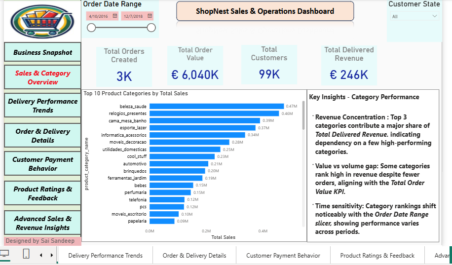
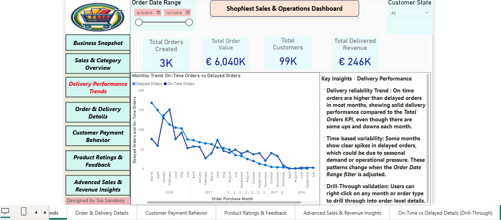

# ShopNest Sales & Operations Dashboard (Power BI)

## Problem
Businesses often lack clear visibility into sales performance, delivery efficiency, and customer behavior, making it difficult to identify operational gaps.

## Dashboard Preview
### 1. Sales Overview 

This page provides a high-level view of total orders, revenue, and customer count. 
---
### 2. Delivery Performance Trends 

This section analyzes on-time vs Delayed orders over time.

## Objective
To build an interactive dashboard that provides insights into key business metrics and supports data-driven decision-making.

## Tools Used
- Power BI
- DAX
- Data Modeling

## Key Metrics
- Total Orders (3K)
- Total Revenue (€246K)
- Total Customers (99K)
- Order Trends Over Time

## Key Analysis
- Compared on-time vs delayed deliveries across months
- Analyzed monthly trends in order volume and delivery performance
- Evaluated customer behavior and payment patterns
- Assessed overall sales and revenue distribution

## Key Insights
- On-time deliveries were consistently higher than delayed orders
- Some months showed spikes in delayed deliveries due to operational pressure
- Delivery performance trends highlight improvement opportunities
- Customer trends indicate variations in engagement

## Outcome
Developed a business-focused dashboard that improves visibility into operations and supports better decision-making.

## Project File 
[Downlaod Power BI Dashboard][https://drive.google.com/file/d/1_aR87BxAFR0vFKtcbeAyF5lCN8i9dG98/view?usp=sharing)
